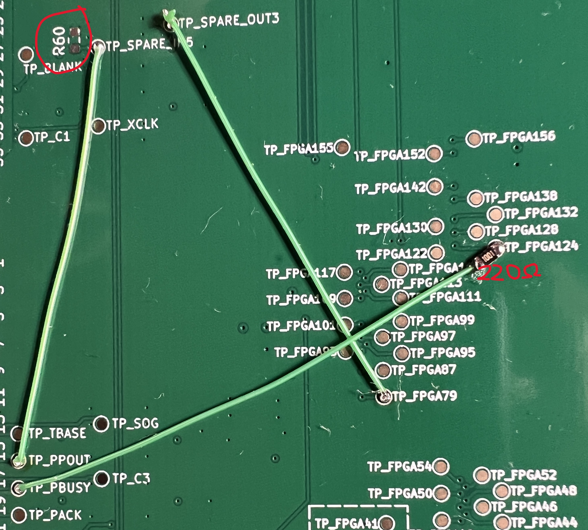

# BeamBender BigBox — the Amiga tools

Five programs that talk to a BeamBender BigBox card from the Amiga it is
plugged into. Everything the card can do from its own on-screen display (OSD)
and its three buttons, you can do from here instead, with a keyboard and a
mouse and somewhere to read the numbers.

| | what it is for |
|---|---|
| [**BBLink**](#bblink) | the window. Every setting, the live pages, the card's buttons, and your settings backed up to a file. This is the one you will use. |
| [**BBMode**](#bbmode) | runs in the background and tells the card which monitor mode the Amiga just switched to. No longer needed - the card detects every mode by itself, reliably - but still here for anyone who wants the card told rather than left to measure. |
| [**BBSurvey**](#bbsurvey) | opens every screen mode the Amiga has, one after another, and logs what the card measures on each. |
| [**BBProbe**](#bbprobe) | for when nothing answers. It prints the raw bytes on the wire and squares up one line at a time so a meter or a scope can find the break. It also reads raw lines of the picture. |
| [**BBScreen**](#bbscreen) | opens one screen mode with a test pattern and runs a command in front of it. |
| [**BBLag**](#bblag) | a field counter in digits big enough to film, for measuring the card's lag against the Amiga's own video. |
| [**BBKeyCon**](#bbkeycon) | a commodity: Left Shift + Left Alt + a key presses the card's buttons and brings up its pages, from any screen. |

They share one link and take it only for the length of a single exchange, so
they can all run at the same time.

---

## Before anything will work

**The three link wires have to be fitted to the card.** On the revision 0.3
board they are three short wires and one resistor between test points that
are already there, plus one resistor to remove. See
[Wiring the link on a revision 0.3 board](#wiring-the-link-on-a-revision-03-board)
below. Without them the tools will say nobody answered, and they will be
right.

**Firmware and tool versions belong together.** BBLink shows the card's
firmware version in its title bar and its own under **About BBLink...**;
when the two firmware numbers differ, rebuild the tools against the
firmware you are running (see the About section below). A page or a row
the running firmware does not have is simply missing from the tool rather
than opened in the wrong place.

**Unplug any printer from the parallel port.** A printer holding the BUSY
line high blocks the card's side of the conversation. Nothing is damaged, it
simply cannot be read.

**AmigaOS 2.0 or later.** Nothing to install: everything these use is in ROM,
and `misc.resource`, which hands out the parallel port, is older than that.

## Installing

Unpack `bblink.lha` wherever you like — `SYS:Tools` is a reasonable home.

```
lha x bblink.lha
```

LhA keeps the protection bits, so the executable flag survives the trip and
none of the five needs `Protect +e`. The archive holds the five executables
and nothing else; this guide sits beside it.

## Wiring the link on a revision 0.3 board

The link is three signals from the Amiga's parallel port, which reach the
video slot on CN622: **PPOUT** (the clock, Amiga to card), **PSEL** (data,
Amiga to card) and **PBUSY** (data, card to Amiga). PSEL is already routed
on the board. The other two are made with wire on the test points, as the
photo shows:



1. **TP_PPOUT to TP_SPARE_IN5** - a wire. PPOUT goes in through a spare
   channel of the 5 V to 3.3 V buffer.
2. **TP_SPARE_OUT3 to TP_FPGA79** - a wire. The buffered PPOUT reaches the
   FPGA.
3. **TP_FPGA124 to TP_PBUSY through a 220 Ω resistor** (200 Ω is fine too).
   The card's reply. The FPGA only ever pulls this line low; the Amiga's
   own pull-up makes the high, so no 3.3 V is ever driven onto the 5 V net.
4. **Remove R60**, the 0 Ω link circled in the photo, which ties SPARE_IN5
   to ground. Leaving it fitted holds the clock input low and nothing will
   ever answer.

Four solder joints and one part lifted. Nothing else on the board changes,
and the card works exactly as before with the wires fitted and no tool
running.

---

# BBLink

Double-click it, or run it from a Shell. A window opens on the default public
screen with the card's firmware version in the title bar:

```
BBLink 1.19  2026-09-22.01 i9
```

**That version is the CARD's**, read over the link. The tool's own is under
**About BBLink...** in the Project menu (right mouse button):

```
BBLink 1.19  for firmware 2026-09-22.01
Sep 20 2026  20:30:00

Card: 2026-09-20.02 i9
```

If those two firmware numbers differ, the tool was built against tables from
another firmware. It still runs, but a setting that moved between those two
versions will be in the wrong place, so rebuild it against the firmware you
are running.

The second line is when that binary was compiled, and it is the one to look
at when a rebuild does not seem to have taken. It is fixed at compile time,
so it cannot be stale, and it settles at a glance whether the program in
front of you is the one you just built or an older copy still sitting on
the Amiga. The About BUTTON on the main screen is the card's own About page,
which is about the card.

## The main screen

Top to bottom:

- **Output Format**, **Output Frequency**, **Status Lines** and **Menu
  Position**, the settings you change most often. Output Format drops a
  list under its button - one row a format, the current one marked `>`:
  click the format you want and the card switches
  to it, or click anywhere else to leave it. The list is in ascending
  order and shows 720x480 or 720x576 according to the frequency the card
  is on. The other three are cycle gadgets: a click steps to the next
  value. Status Lines turns the two information lines at the top and
  bottom of the picture off and on; Menu Position moves the card's menu
  block through the centre and the four corners of the picture, so it can
  be put where it covers nothing you are looking at.
- **Display Info** | **Input Sampling**
- **Monitor Info** | **Output Geometry**
- **Settings** | **Load Settings** | **Save Settings**
- **Reset to Defaults** | **Report** | **About**
- **Refresh Rate**, with its own gadget: `Off`, `1 second`, `2 seconds`,
  `5 seconds`.
- **MENU** | **MENU Long**
- **UP** | **UP Long**
- **DOWN** | **DOWN Long**

A button that opens another page takes you there; **Go Back <<** at the
bottom of each page brings you home. The line along the bottom of the window
is where the tool tells you what just happened.

## Output Geometry

Five rows, one axis at a time: **Horizontal Offset** and **Horizontal
Scale**, then **Vertical Offset** and **Vertical Scale**. The offsets move
the finished picture inside the frame your monitor is given; the scales
decide how big it is.

Each scale is `Auto` or `x1` to `x6`: how many output columns each captured
source column gets, or how many output rows each source line. `Auto` picks
what the card has always picked - horizontally the multiplier that fills the
4:3 box, vertically the largest that fits the active area - and is right
almost always. Force one when you want something else: smaller, to make
room for **overscan** (capture more with Capture Width or Capture Height and
it grows into the space instead of pushing the scale down a step), or
larger, to fill a 16:9 screen edge to edge with a picture that was never
that shape.

**A scale that does not fit is skipped.** The card's own cycle only stops on
the scales its current output format has room for, given the size of the
capture: 320 columns on 1280x1024 offer `Auto, x1, x2, x3, x4` and skip x5
and x6. From here the gadget still lists every value, and one the card
cannot use is refused with a message rather than taken. Display Info's
`Scale` row (`2x4` is horizontal x vertical) shows what is actually in
force.

The offsets and scales are saved per output format and frequency; the
positions, sampling phase and capture size per monitor mode.

## Changing a setting

Every setting the card has is on one of the pages, one gadget per setting.
Settings that pick from a few values get a cycle gadget, Output Format a
drop-down list, and settings that are numbers get `[-] value [+]`.

A setting the card has greyed out in the current output format is **ghosted**
here too. A gadget you cannot click says the same thing as `N/A` and cannot
be clicked by mistake.

When you change something, the card's own menu appears on the monitor and
moves for a few milliseconds while the card walks to that setting, then it is
put back exactly where it was. That flicker is normal and is the card being
driven, not a fault.

**Nothing is kept until you press Save Settings.** Everything you change is
live immediately and lost at the next power cycle unless you save it.

## The live pages

**Display Info**, **Monitor Info** and **About** are the card's own pages,
row for row. Each is a screen of its own with a **Go Back <<** at the bottom,
so there is nothing else on screen while you are reading one.

A page is read the moment you open it, and then re-read on the timer you set
with **Refresh Rate** back on the main screen. Set that to `Off` and a page is
read once, when you open it, and then left alone until you leave and come
back.

Display Info carries one row the card cannot draw, because it is about the
**Amiga's** end of the link: how many exchanges have been retried and how
many were given up on. A link that works but retries constantly is a wiring
problem, and this is where you see it.

## The card's buttons

**MENU**, **UP** and **DOWN**, and a long press of each. Six gadgets rather
than three that you hold down, because a window cannot time a click reliably
and guessing at it would be worse than saying plainly what each one does.

## Load, Save, Defaults, Calibrate

- **Save Settings** writes everything to the card's flash. It survives a power
  cycle and a fresh bitstream, because it lives in a corner of the flash that
  programming the card does not touch.
- **Load Settings** reads the flash back and throws away everything changed
  since the last save. The row says `Loaded`, or `Failed` when there is no
  usable record in the flash - after the rescue erase, say - and in that case
  nothing at all is changed.
- **Reset to Defaults** puts every setting back and does **not** save. Press
  Save Settings afterwards if that is what you want kept.
- **Calibrate Sampling**, on the Input Sampling page, takes over the card's
  own screen and asks a person to pick a sampling phase with the card's
  buttons. The tool starts it and then gets out of the way.

## Report

**Report** writes `RAM:BBLink.txt`: the firmware version, every page, every
setting and the link's retry counters. This is the one to press before
describing a problem to anybody.

## Backup and Restore Settings

Both are in the **Project** menu, on the right mouse button, with **About
BBLink** under them. Each opens the standard file requester (asl.library;
without it the file is `PROGDIR:BeamBender.settings` and the status line
says so).

**Backup Settings...** reads every setting off the card and writes it as a
text file you can read and edit:

```
# BeamBender BigBox settings
# From a BigBox i9 running 2026-09-22.01, by BBLink 1.19
# The live settings: what Save Settings would have written.

[General]
Output Format = 1920x1080
Output Frequency = Auto
Status Lines = Shown
Menu Position = Center
Deinterlace = Adaptive
...

[Input PAL]
Horizontal Position = 413
Vertical Position = 40
Vertical Half Line = No
Sampling Phase = 102
Pixel Phase = 0
Capture Width = 640
Capture Height = 256

[Output 1920x1080 50Hz]
Horizontal Offset = 0
Vertical Offset = 0
Horizontal Scale = Auto
Vertical Scale = Auto
```

The scales are under the OUTPUT they belong to: a scale is an answer to
how big the picture should be on a given output, and the card keeps one
pair per output format alongside the offsets.

The words are the card's own: what a row shows on the monitor is what the
file says. It is the **live** settings that are written, including anything
changed and not yet saved; if you want exactly what is in the flash, press
Load Settings first.

**Restore Settings...** reads such a file and sends it to the card. Names are
matched, not positions, so a file from an older firmware puts back everything
it has and leaves the rest as the card has it; a name the card does not know,
or a value it cannot take, is counted and shown before anything is sent, and
you can stop there. The card checks the whole record before it applies any
of it, so a file it will not accept changes nothing. Afterwards the tool
reads the settings back and says whether they match - and then asks whether
to **Save Settings**, because a restore lives only until the next power
cycle until you do.

This is also the way to carry settings across a firmware update that changes
the record format: back up before, restore after, and the positions and
sampling phases you spent an evening on are back without a button pressed.

### From a Shell

Both work without the window, for scripts and for a backup before every
firmware update:

```
BBLink BACKUP <file>            the live settings to a file
BBLink RESTORE <file>           a file to the card; not saved to the flash
BBLink RESTOREANDSAVE <file>    a file to the card AND into its flash
BBLink ... QUIET                say nothing; the return code is the answer
```

The keywords are AmigaDOS ones, so `BBLink backup SYS:bb.settings` and
`BBLink BACKUP=SYS:bb.settings` are the same command. A restore from the
shell has nobody to ask, so a name the card does not know or a value it
cannot take is reported and the rest is sent. The return code is 0 when
everything was done, 5 (WARN) when the restore went in but something in the
file was skipped, and 20 (FAIL) when nothing was changed: the file could not
be read, the card refused the record, or the save did not verify. A script
can test it:

```
BBLink RESTOREANDSAVE SYS:bb.settings QUIET
IF WARN
  Echo "Some of the file was not restored"
ENDIF
```

---

# BBMode

**Run it from a Shell**, or put it in your `S:User-Startup`.

```
BBMode              follow the front screen until Ctrl-C
BBMode QUIET        the same, silently
BBMode ONCE         set the card to match the screen now, then exit
BBMode KEEP         do not put the card back on Auto on the way out
BBMode DELAY=n      how often to look, in ticks (default 25, half a second)
```

It prints one line every time the screen mode changes and nothing at all in
between:

```
PAL:High Res             -> PAL        ok
DBLPAL:High Res Laced    -> DBLPAL     ok
SUPER72:High Res         -> SUPER72    ok
```

`ok` means the card **read back** in that mode, not merely that a message was
sent.

## What it is for

**You do not need it.** The card works out which monitor it is looking at
from the line length and the lines per field, and the A2024 from its
colour signature, and it does so reliably for every mode the Amiga has;
that is what **Auto** does, and Auto is the right setting. BBMode exists
for the one thing a measurement cannot do: the Amiga chose the mode, so it
knows which monitor it is about to produce before the first line is drawn,
and BBMode passes that on, so the card need not wait the few frames the
measurement takes to settle.

It changes nothing else: not the sampling phase, not the positions, not the
capture height. Those are per-monitor settings the card already keeps and
reloads by itself. This only says **which monitor**.

## In your startup

```
Run >NIL: <NIL: BBMode QUIET
```

`Break <task>` stops it, exactly as Ctrl-C does from a Shell. Started from
Workbench it goes quiet by itself, since there is nowhere for it to print.

## On the way out it puts the card back on Auto

Unless you give it `KEEP`. A card left pinned by a program that is no longer
running will sample the next 15 kHz mode with 29 kHz settings, and nobody ever
connects that to something they stopped an hour ago.

## If a mode prints "monitor not in the table"

```
FOO:Something            -> Auto       (monitor not in the table)
```

The card is left on Auto, which is exactly where it would have been without
BBMode, so nothing is worse. Send that line on and the monitor can be added.
BBMode matches on the monitor name, the part before the colon, and knows
PAL, NTSC, EURO (36Hz and 72Hz told apart by the mode name), A2024 (PAL or
NTSC by the standard the machine booted in), SUPER72, DBLPAL, DBLNTSC,
MULTISCAN, VGA and PRODUCTIVITY (the last two as Multiscan). A plain mode
with no monitor name follows the boot standard.

---

# BBSurvey

**Run it from a Shell, in the drawer the log should land in.** It opens
every screen mode in the display database one after another, waits for the
card to settle on each, and writes one line per mode to `BBSurvey.log` in
the current directory: what the Amiga calls the mode and what the card
measured on it. It is how the table of monitor modes inside the card was
built, from measurement rather than from memory, and it is the quickest
way to show that every mode a machine has is recognised.

```
BBSurvey                 every mode, log to BBSurvey.log here
BBSurvey FILE=name       the log goes there instead
BBSurvey MONITOR=name    only that monitor's modes (PAL, DBLPAL, SUPER72 ...)
BBSurvey DEPTH=n         screen depth, default 2 (four colours)
BBSurvey WAIT=n          give a mode up after n seconds (default 5)
BBSurvey ALL             include the VGAONLY monitor and the HAM, EHB and
                         dual-playfield variants, which are the same timing
                         under another name
BBSurvey QUIET           nothing on the console; the log says it all
```

What happens, in order. It reads the card's live settings and keeps a copy
in memory and in `BBSurvey.settings` beside the log (a BBLink settings file,
so it can be restored by hand if the run is broken off). Then, for each
mode that the OS says is available, it opens a screen of the mode's nominal
size, paints it in bands of white, red and blue plus a band of single-pixel
stripes (the LoRes detector needs neighbouring pixels that differ; flat
colour reads as LoRes on every mode) with the mode's name at the top, and
polls the card until what it measures has stopped changing: the
flywheel re-locks, the standard detector settles and the monitor comes back
over a few seconds, exactly as a ScreenMode prefs switch does. Five reads a
fifth of a second apart that all agree, after at least a second, count as
settled; `WAIT` seconds is the give-up and the line is marked
`(NOT SETTLED)`. Each line ends with `SETTLE n.ns`, the time after the
screen opened at which the card's reading last changed, which is the
card's own settling time without the second of caution the five reads add
(so a mode that settles at 0.4s costs the tool about 1.4s). The line is
written, the screen closed, the next opened.
At the end the settings are read back and, if anything differs from the
copy, the copy is put back over the link. Ctrl-C stops the walk early and
still restores.

A line looks like this (one line in the file; wrapped here):

```
00021000  PAL:High Res                   640x256  PROG PAL    4  |
  PAL HIRES PROG         Locked (green)  LINES 312  LEN 1816  15.62 kHz
  RGB FFFFFF  PAIRS 0 0  UND 0  OVR 0  CAP 640x256  28M H+V Sync
  SET PAL  MODE Auto  SETTLE 0.6s
```

Left of the bar is the Amiga's side: the ModeID, the name, the nominal size,
whether the OS calls it interlaced and PAL, the maximum depth. Right of it is
the card's: the Input row as the OSD shows it, the lock state, lines per
field, line length in capture clocks, line rate, the colour bits that ever
lit (an A2024 mode always reads `888899` because its four one-bit planes
never light more, which is why A2024 screens are opened with all four
whatever `DEPTH` says, falling back to fewer if the chip RAM will not take
half a megabyte), the pair counters, under/over, the capture size the set
gave, the clock and sync source, the set in use and the Input Mode setting.

The header also records the tool's own version, the standard the Amiga
booted in (the jumper, from graphics.library's DisplayFlags) and the
capture clock the card measures: 28375 kHz is the PAL crystal, 28636 the
NTSC one, so the crystal-and-jumper combinations need no renaming by hand.

The output format is left alone: everything on the card's side of the line
is measured on the input, and none of it depends on what the HDMI side is
doing. The header of the log records the output format, the hardware and
the LoRes Capture setting anyway. Nothing is changed on the card by the
survey itself; if `BBMode` is running it goes on pinning the class, and the
`MODE` column shows it.

Only the monitors whose drivers are in `DEVS:Monitors` are in the display
database, so put the ones to be surveyed there first (PAL, NTSC, Euro36,
Euro72, Super72, DblPAL, DblNTSC, Multiscan, A2024) and reboot. A mode the
OS lists but cannot open is logged as `not available`.

---

# BBProbe

**Run it from a Shell, not from Workbench**, or its output goes nowhere.

```
BBProbe              ping in a loop, printing every reply, until Ctrl-C
BBProbe ONCE         one exchange, printed, exit
BBProbe TOGGLE       square-wave the CLOCK line until Ctrl-C
BBProbe TOGGLEDATA   square-wave the DATA line until Ctrl-C
BBProbe RETURN       read the return line twice a second and print it
BBProbe HAMMER       exchanges back to back, nothing printed
BBProbe RAW aa bb cc dd ee    send five bytes exactly as given
BBProbe LINE n [TO m] [COUNT k] [SHIFT s] [PHASE p] [FILE name]
                     the raw pixels of input line n
```

`LINE` is the odd one out: it looks at the picture, not the wire. The card
keeps one line of what the Amiga is sending, in the card's own capture
clocks, and this reads it back: 1024 entries of `R G B` (red and green as
their top four bits, blue as all eight), one entry every `2^SHIFT` clocks
(1, the HiRes pixel rate, unless given), for line `n` counted the way
Vertical Position counts (lines after the vertical sync). `TO m` walks a
range of lines, `COUNT k` takes the same line from k frames in a row, and
`FILE` writes it out instead of printing it. About 0.4 s a line. It exists
for the A2024, whose frames say which quarter of the picture they carry in
a line of coloured marks near the top - which is how the A2024 support was
measured.

This exists because "no BeamBender answered on the parallel port" is the same
sentence whether the clock never left the Amiga, the buffer never passed it
on, the card never answered, or the card answered and the bits were wrong. The
five bytes that actually came back tell those apart in one look:

| what you see | what it means |
|---|---|
| `FF FF FF FF FF` | nothing is driving the return line at all |
| `00 00 00 00 00` | the return line is stuck low |
| status bit 7 clear | something answered, but it was not the card |
| `ok` with a value | the transport is working |

`TOGGLE` is the one to put a scope on. BBLink sends a few hundred
microseconds of traffic and stops, which is nothing you can trigger on by
hand; this holds one line square for as long as you like, so it can be
followed from the test point on the motherboard all the way to the card's
field-programmable gate array (FPGA) pin. `HAMMER` does the same job for a
plain multimeter, by keeping the return line busy about half the time.

---

# BBScreen

**Run it from a Shell.** It opens one screen mode with a test pattern on
it, runs a command while the screen is in front, closes the screen and
gives you back whatever was there before:

```
BBScreen MODE "A2024:15Hz"                  the pattern for 10 seconds
BBScreen MODE "A2024:15Hz" WAIT 0           ...until Ctrl-C
BBScreen MODE 49000 CMD "BBProbe LINE 18"   run a command with the screen up
```

MODE is the start of a mode's name as ScreenMode prefs shows it, either
case, or the mode's hex number. The pattern is rulers every 64 pixels, a
grey ramp and single-line stripes across the top, a white border, and one
to four white blocks in the four quarters of the screen so that a line read
back over the link says which quarter it came from by counting. An A2024
mode opens four planes deep, which BBSurvey found is what makes the A2024
signal complete; `DEPTH n` overrides.

With `CMD "BBProbe LINE n FILE name"` it captures a line of a mode that
only exists while a screen of that mode is open, which is what it is for.

---

# BBLag

**Run it from a Shell.** It measures nothing itself: it puts a counter on
the screen that advances every field, in digits 64 pixels tall, so that a
camera can film a monitor on the Amiga's own video and the card's monitor
in the same shot. The two numbers in one frame of that video differ by the
card's lag, in fields (20 ms each on PAL, 16.67 on NTSC).

```
BBLag                        PAL or NTSC High Res, until Ctrl-C
BBLag MODE "PAL:High Res"    a mode by name or hex number, as BBScreen
BBLag WAIT 30                stop after 30 seconds
```

The screen shows, top to bottom: a bar that steps right every field and
wraps every 32 (readable through motion blur when the digits are not); the
count's low eight bits as eight squares; the field count; the same count
in milliseconds. Everything is drawn in the first lines after the vertical
blank, so each field carries one complete number.

Film at 60 frames a second to read the lag to a field, or in a phone's
slow-motion mode (120 or 240) to read it finer - the CRT's beam is visible
as a bright band then, and the lag is the time between the same row of the
same number on the two screens. Take the difference that repeats across
ten or more frames: any camera frame that straddles a vertical blank
catches one screen mid-change.

Interlaced modes advance the count every field too, but each field
carries half the rows, so the digits read as two numbers interleaved:
use a non-interlaced mode unless the interlaced path is the one being
measured, and then read the bar and the squares.

---

# BBKeyCon

A commodity that puts the card's three buttons, and its pages, on the
keyboard - so the menu can be opened, walked and closed while a game or a
demo has the screen, without reaching into the machine or leaving for
BBLink's window. Start it once:

```
Run >NIL: <NIL: BBKeyCon QUIET       from the startup-sequence
BBKeyCon                             from a Shell, until Ctrl-C
BBKeyCon MODS "lshift lcommand"      other modifier keys (default lshift lalt)
BBKeyCon TEST                        the link stays closed: each key that
                                     matches is printed, nothing reaches the card
BBKeyCon VERBOSE                     as normal, and every press is printed
```

**Try `BBKeyCon TEST` first** on a machine it has not run on: it lists the
nine key descriptions the OS accepted, then prints a line for every chord
that matches, and the card is never touched. If a chord prints nothing, the
keymap or the `MODS` pair is the thing to look at, not the link.

Hold **Left Shift and Left Alt**, then press:

| key | does |
|---|---|
| Esc | opens the menu, or closes whatever is open (menu, submenu, page) |
| Cursor Right | the MENU button: enter the row, accept a value (with the menu closed, opens it) |
| Cursor Up | the UP button: previous row, value up (repeats while held) |
| Cursor Down | the DOWN button: next row, value down (repeats while held) |
| Cursor Left | a long MENU press: abandons an Output Format choice; with the menu closed, toggles the status lines |
| D | the Display Info page |
| M | the Monitor Info page |
| S | the Settings submenu |
| A | the About page |

From a page, Esc closes the menu and Right, Up or Down go back to the
menu, as any button does at the card. The four cursor keys are the whole
of the menu: Up and Down walk it, Right goes in, Left backs out. The keystrokes never reach a window.
It shows in Exchange as "BBKeyCon", where it can be disabled or removed.

Left Shift + Left Alt is the pair no part of the OS uses: the Left Amiga
key with the cursor keys is Intuition's mouse emulation (and with Left Alt,
the mouse button), Left Amiga + N and M flip screens, Right Amiga is every
program's menu shortcut. `MODS` takes any two of `lshift`, `lalt` and
`lcommand` (Left Amiga) if a program of yours wants the default pair.

It holds the link open while it runs, which takes the parallel port only for
the length of a frame, so BBLink and BBMode run beside it. A press that
seems to do nothing was a frame lost to the link; press again.

Two guards, after version 1.0 took the whole input stream with it on the
bench (the menu toggling on every mouse movement and timer tick, keyboard
and mouse dead until a reset): every key filter is checked for having
taken its description before the commodity goes live, and more than twenty
presses inside one second - no hand on a keyboard does that; a held Up
repeats at ten - makes it switch itself off and exit, which gives the
input back. Caps Lock is ignored on all nine keys.

---

# When something is wrong

**"No BeamBender answered on the parallel port."**
Run `BBProbe ONCE` and read the five bytes. `FF FF FF FF FF` means nothing is
driving the line: check the three jumpers first, then that the card is running
firmware new enough to have the link at all.

**"The parallel port is held by ..."**
Something else has it: a printer driver, or a program that took it and did not
give it back. The name of the holder is in the message.

**The tool works but the counters climb.**
Look at the retry and failure counts on Display Info. Retries a few times a
minute on an otherwise working link are normal. A steady stream of them is a
wiring problem: too long a jumper, a dry joint, or a serial cable holding one
of the shared lines.

**A setting is greyed and you think it should not be.**
The card decides that, not the tool. A setting that does nothing in the
current output format is greyed on the card's own menu too.

**BBLink's title says a different version from the card.**
The tool was built against different firmware. It still runs, but rebuild it
against the firmware you are actually using before trusting a setting that
moved between the two.

**Your settings came back as defaults after flashing.**
The record the card saves has a format version, and when it changes the card
refuses the old record rather than reading the fields out of the wrong bytes.
Set your positions, sampling phases and capture heights once more and press
Save Settings. It will stay after that.

