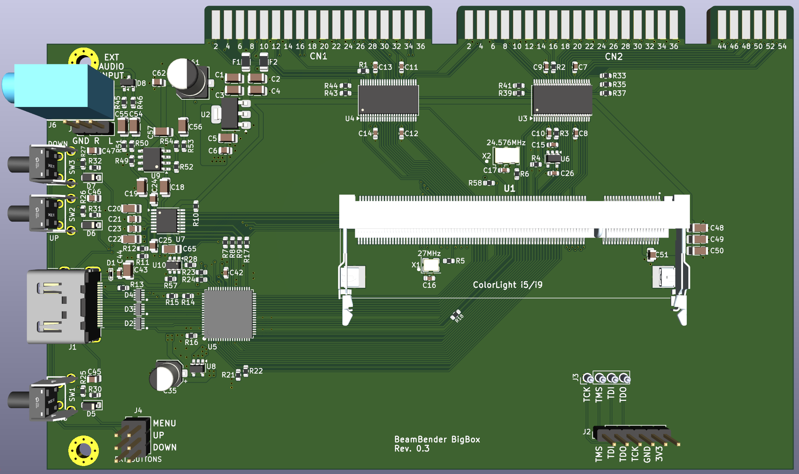
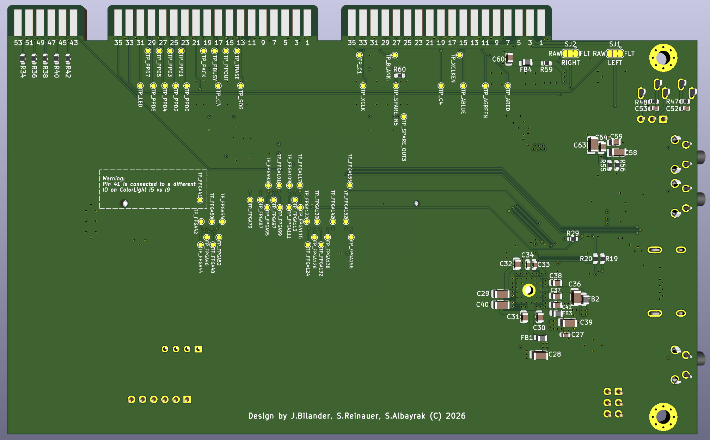

# BeamBender BigBox

A digital scandoubler and HDMI output card for the **Amiga 4000**, with **Amiga 2000 / 3000** support as a secondary target.

The card plugs into the video slot, taps the digital RGB signals before they ever reach a DAC, and outputs clean **1080p HDMI** with audio. No analogue stage, no capture artefacts, no flicker.

> This project is a big-box adaptation of [**jbilander/BeamBender**](https://github.com/jbilander/BeamBender), Jörgen Bilander's  scandoubler for the Amiga 1200 (and 500). The original design's approach and much of its analogue and HDMI circuitry carry over directly. Jörgen has also provided hardware guidance throughout this redesign. All credit for the concept belongs upstream.

---

## What's different from the A1200 original

The A1200 version clips onto the Lisa chip and connects to the main board via an FFC cable. Big-box Amigas expose the same signals on the video slot, so this version is a **single PCB with no cables**. It takes digital RGB, syncs and the pixel clock straight off the slot fingers, along with audio and power.

| | A1200 BeamBender | BeamBender BigBox |
|---|---|---|
| Signal source | Lisa chip (PLCC-84 clip) | Video slot |
| Boards | Two, joined by FFC | One |
| FPGA | Gowin GW1NR-9 (on-board) | Colorlight i5 module (SO-DIMM socket) |
| Video RAM | FPGA-internal | 8 MB 32-bit SDRAM on module |
| Audio in | 3.5 mm jack | Video slot (`lineLF` / `lineRT`) |
| Power | External connector | Slot |

---

## Hardware

**FPGA:** a [Colorlight i5 v7.0](https://github.com/wuxx/Colorlight-FPGA-Projects) module in a 200-pin DDR2 SO-DIMM socket (TE 1473149-4). The module carries a Lattice **ECP5 LFE5U-25F** (24k LUT), **8 MB of 32-bit SDRAM** for field storage, plus its own configuration flash and regulators.

Using a module rather than a bare FPGA is deliberate. The ECP5 only comes in BGA, and this design has a hard no-BGA-in-my-hands rule. A dead module is a socket swap, not a rework station. The **i9** (LFE5U-45F, 44k LUT, 4 PLLs) is pin-compatible and drops straight in, and **SO-DIMM pin 41 is left unconnected** specifically to keep that path open, since it's the one ball that differs between the two.

**Video out:** an **SiI9022A** HDMI transmitter fed 24-bit parallel RGB888 at up to 148.5 MHz. Bit-banged TMDS would not reach 1080p60 on a non-SERDES ECP5, so a real transmitter earns its place.

**Audio:** an **AK5720** 24-bit ADC digitises the Amiga's line audio from the slot and feeds I²S to the SiI9022A.

**Level shifting:** two 74LVC16244 buffers translate the Amiga's 5 V logic to 3.3 V. The ECP5 is *not* 5 V tolerant, so these are mandatory rather than optional.

**Board:** 157.5 x 90 mm, 4-layer, with dedicated ground and 3V3 planes.

### Where to buy the module

[Colorlight i5 + ext-board bundle on AliExpress](https://www.aliexpress.us/item/3256807602160285.html)

Buy the **module and the dev board together**. The BigBox card provides a JTAG header to program the module in place using an external programmer, but having the ext-board as well gives you a second, independent way to load and recover a bitstream, which may come handy.

---

## Clock architecture

Four clock inputs, on four dedicated ECP5 primary-clock pins.

| Clock | Source | ECP5 pin | PLL |
|---|---|---|---|
| **C280**, 28.375 MHz PAL / 28.636 NTSC | Alice, via slot | 91 · `PCLKT2_1` | none, already the pixel clock |
| **VCDAC x2**, 14.19 MHz | Agnus/Alice CDAC, doubled on-board | 81 · `PCLKT3_1` | x2 to 28.375 MHz |
| **27 MHz** | on-board oscillator | 134 · `PCLKT7_1` | x5.5 to 148.5 MHz output |
| **24.576 MHz** | on-board oscillator | 89 · `PCLKT2_0` | none, audio MCLK reference |

Two details behind those choices:

**27 MHz is not arbitrary.** 148.5 MHz, the pixel clock for 1080p at both 50 and 60 Hz, is exactly 27 x 5.5, which the ECP5 PLL reaches cleanly. The module's own 25 MHz reference cannot produce it at any legal divider setting.

**The A2000 and A3000 have no 28 MHz clock on their video slots.** The fastest available is VCDAC at 7.09/7.16 MHz, which sits below the ECP5 PLL's 8 MHz input minimum. So an XOR gate and an RC delay double it to 14.19 MHz on-board, and the PLL takes it from there. Crude, cheap, and it adds no jitter of its own.

The two clocks that need PLLs sit on opposite die edges (banks 7 and 3), so each reaches its nearest PLL. That matters, because the LFE5U-25F only has two.

---

## Amiga 2000 / 3000 support

The pre-AGA video slot carries **12-bit color** (RGB444) rather than AGA's 24. Each nibble is replicated into both halves of an 8-bit channel, which is multiplication by 17. That maps 0 to 0 and 15 to 255 with no rounding error at any level.

Machine detection is passive. The AGA video slot extends the connector with pins 43 to 54, which don't exist at all on the A2000 and A3000. Pins 43 and 44 are ground, and 45 to 54 carry the extra color bits. A 10 kΩ pull-up on pin 43 therefore reads low on an A4000 and high everywhere else. The ten color lines on pins 45 to 54 get 100 kΩ pull-downs so their buffer inputs never float on a machine where those pins are absent.

---

## Programming

The module's JTAG pads aren't on the SO-DIMM edge, so four **spring-loaded pogo pins** contact them from below when the module is seated. A **1x6 JTAG header** runs in parallel for an external programmer. An FT232H or FT2232H dongle works directly with `openFPGALoader` or `ecpprog`.

Bitstreams can be loaded to SRAM for fast iteration, or written to the module's SPI flash through the same connection so the card boots on its own.

---

## Video modes

Input runs up to **1440x580 PAL superhires with overscan**, and output is scaled to **1920x1080**.

Deinterlacing is mode-dependent, because the right answer differs by content. Superhires laced modes are almost always Workbench, which is static, text-heavy, and rewards sharpness, so those get **weave**. Standard hires laced modes carry games and mixed content, so those get **motion-adaptive** processing. Splitting it this way keeps peak memory bandwidth inside what a single 32-bit SDRAM interface comfortably delivers.

---

## Status

**Hardware design complete. Nothing has been fabricated or tested yet.**

Schematic and PCB are done and reviewed. Gateware is not written. Treat every number here as intent rather than measurement.

Known open items:

- [ ] First article fab and bring-up
- [ ] Measure actual current on the 5 V and 3.3 V rails
- [ ] Capture-phase calibration: sweep the sampling point and find the eye centre on real hardware, on both machine types
- [ ] Gateware: capture, deinterlace, scale, HDMI output, OSD
- [ ] Verify card outline and finger geometry against a physical A4000
- [ ] `PSEL` is wired to the FPGA but unused, reserved for an automatic HDMI switcher in a later revision

---

## Building one

Not yet recommended as there is no firmware to test with yet. The Gerbers have not been provided, but can be created from Kicad files if you feel adventurous. 

When that time comes, the PCB is designed around **JLCPCB** fabrication and assembly, with part selection biased toward their basic library. The Colorlight i5 module and the pogo pins are hand-fitted afterwards.

---

## Credits

- **[Jörgen Bilander](https://github.com/jbilander)**, original BeamBender design, and ongoing guidance on this adaptation
- **[Salih Albayrak (aka Kavanoz)](https://github.com/kavanoz64)**, hardware design and implementation for BigBox
- **[Stefan Reinauer](https://github.com/reinauer)**, FPGA programming (planned)
- **Claude AI** (Anthropic), design review, component selection and documentation
- **[wuxx](https://github.com/wuxx/Colorlight-FPGA-Projects)** and the Colorlight reverse-engineering community, for module pinouts and documentation that the vendor doesn't publish

## License

Please check the licensing of the upstream [BeamBender](https://github.com/jbilander/BeamBender) project before redistributing derived work.
