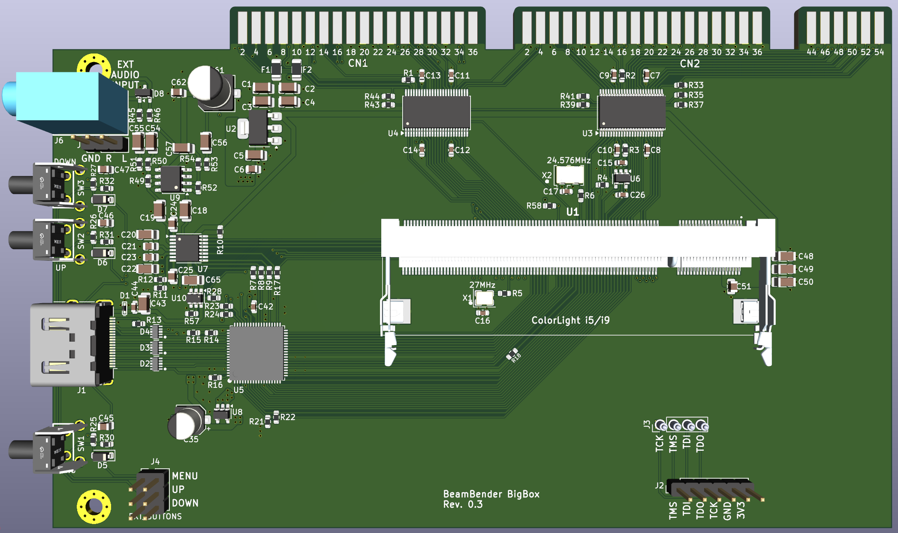
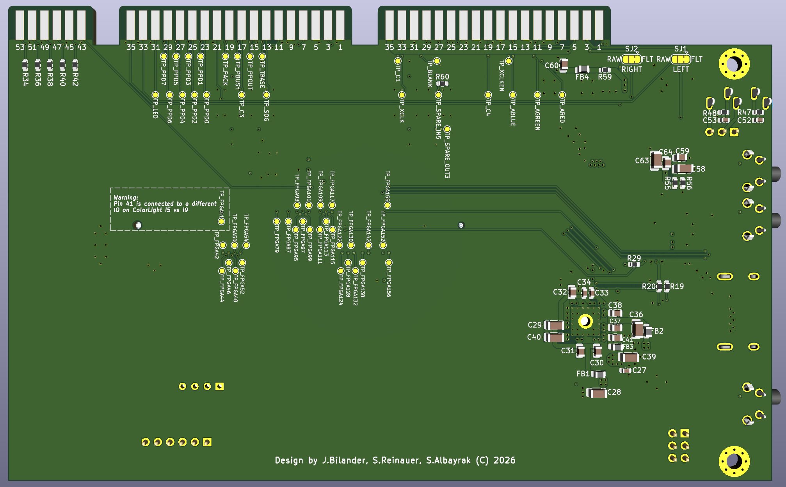
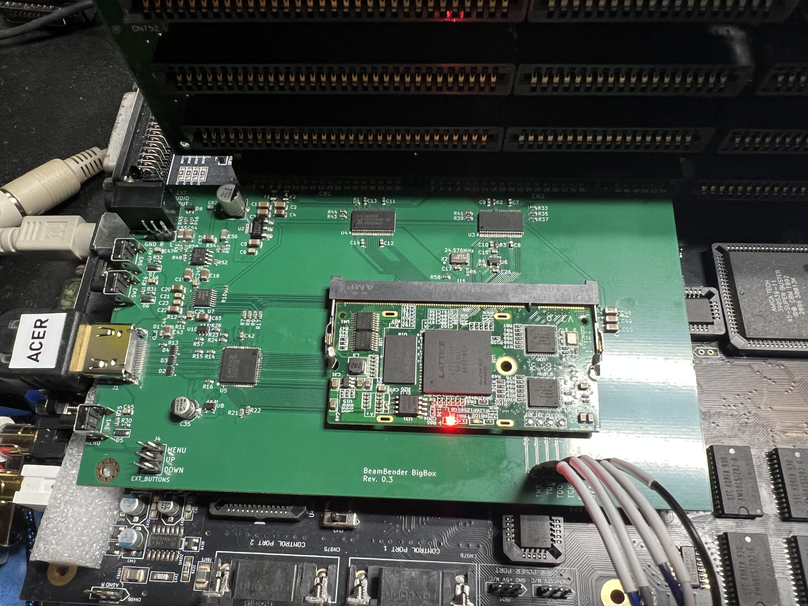

# BeamBender BigBox

A digital scandoubler and HDMI output card for the **Amiga 4000**, with the **Amiga 2000 and 3000** supported as well.

The card plugs into the video slot, taps the digital RGB signals before they ever reach a DAC, and outputs clean **HDMI** with audio. No analogue stage, no capture artefacts, no flicker.

> This project is a big-box adaptation of [**jbilander/BeamBender**](https://github.com/jbilander/BeamBender), Jörgen Bilander's scandoubler for the Amiga 1200 (and 500). The original design's approach and much of its analogue and HDMI circuitry carry over directly. Jörgen has also provided hardware guidance throughout this redesign. All credit for the concept belongs upstream.

**Status: revision 0.3 hardware built and working on the Amiga 4000D, 4000T, 3000 and 2000 (ECS and OCS). Every Amiga monitor mode captured, including the A2024; interlaced modes deinterlaced motion-adaptively on both modules; integer and blended half-step scaling on both axes; with the Si5351C clock generator fitted, every output format on the i5 as well as the i9.** See [Status](#status) for detail.

---

## What's different from the A1200 original

The A1200 version clips onto the Lisa chip and connects to the main board via an FFC cable. Big-box Amigas expose the same signals on the video slot, so this version is a **single PCB with no cables**. It takes digital RGB, syncs and the pixel clock straight off the slot fingers, along with audio and power.

| | A1200 BeamBender | BeamBender BigBox |
|---|---|---|
| Signal source | Lisa chip (PLCC-84 clip) | Video slot |
| Boards | Two, joined by FFC | One |
| FPGA | Gowin GW1NR-9 (on-board) | Colorlight i5 or i9 module (SO-DIMM socket) |
| Video RAM | FPGA-internal | 8 MB 32-bit SDRAM on module |
| Audio in | 3.5 mm jack | Video slot, plus aux header and jack, mixed |
| Power | External connector | Slot |

---

## Hardware

**FPGA:** a [Colorlight i5 v7.0](https://github.com/wuxx/Colorlight-FPGA-Projects) module in a 200-pin DDR2 SO-DIMM socket (TE 1473149-4). The module carries a Lattice **ECP5 LFE5U-25F** (24k LUT), **8 MB of 32-bit SDRAM** for field storage, plus its own configuration flash and regulators.

Using a module rather than a bare FPGA is deliberate. The ECP5 only comes in BGA, and this design has a hard no-BGA-in-my-hands rule. A dead module is a socket swap, not a rework station. **SO-DIMM pin 41 is left unconnected** specifically so that the i5 and the i9 are interchangeable, since it is the one ball that differs between the two.

**The i9 (LFE5U-45F, 44k LUT, 4 PLLs) is the recommended module.** It is pin-compatible, it drops straight into the same socket, and the extra fabric and the two extra PLLs are doing real work: on a board without the clock generator below, the i9's PLLs are what clock the four VESA output formats, and it is the module with headroom for whatever comes next. Build with an i9 unless cost is the deciding factor.

The **i5 (LFE5U-25F)** remains fully supported as the cheaper option, with its own bitstream. On its own it covers the CEA formats plus 1920x1200, which is everything most people need for a television or a modern monitor; with the **Si5351C** fitted it has every format the i9 has. It is the fuller module, at 77 % of its logic now, so it is also the one that decides what fits.

**Clock generator:** an **Si5351C** (16-QFN) provides the pixel clocks the ECP5's PLLs cannot make from 27 MHz - 162 MHz for 1600x1200, 108 for 1280x1024, 65 for 1024x768 and 40 for 800x600 - on four inputs of the module. It was added to the revision 0.3 board as a rework and is part of the next revision. One firmware per module serves boards with and without it: at power-up the card measures the four pins, decides once which clocks are there, and offers each VESA format only while its clock is; an i9 falls back to its own PLL for a format whose clock is missing, an i5 drops to 1280x720. A one-output variant of the firmware (`-si1`) drives every VESA format from CLK0 alone, retuning the part over I²C at each format change, for a board that routes only that one output.

**Video out:** an **SiI9022A** HDMI transmitter fed 24-bit parallel RGB888 at up to 148.5 MHz. Bit-banged TMDS would not reach 1080p60 on a non-SERDES ECP5, so a real transmitter earns its place.

**Audio:** an **AK5720** 24-bit ADC digitises the audio and feeds I²S straight to the SiI9022A, bypassing the FPGA entirely. Ahead of it, an **OPA1692** inverting summing amplifier mixes the Amiga's line audio from the slot with an auxiliary input, so you can fold in another card's audio or an external source. The aux input appears on both an internal header and a switched 3.5 mm jack, where inserting a plug mechanically disconnects the header. The amplifier runs from the slot's +12 V through its own RC filter rather than the digital 5 V rail, and the ESD clamp on the external jack protects both entry points.

**HDMI +5 V:** HDMI requires the source to supply 5 V on pin 18, and plenty of DIY designs simply tie it to the board rail. That invites two failure modes: a shorted cable dragging your supply down, and cheap televisions pushing 5 V *back* into your system. A **TPS2553** load switch sits in that path instead, current-limited to a guaranteed minimum of 422 mA with reverse-current blocking, so neither can happen. Its enable and fault lines run to the FPGA, and the on-screen display reports the fault line.

**Level shifting:** two 74LVC16244 buffers translate the Amiga's 5 V logic to 3.3 V. The ECP5 is *not* 5 V tolerant, so these are mandatory rather than optional.

**Board:** 157.5 x 90 mm, 4-layer, with dedicated ground and 3V3 planes.

### Where to buy the module

[Colorlight i5 + ext-board bundle on AliExpress](https://www.aliexpress.us/item/3256807602160285.html)

Buy the **module and the dev board together**. The BigBox card provides a JTAG header to program the module in place using an external programmer, but having the ext-board as well gives you a second, independent way to load and recover a bitstream, which may come handy.

---

## Clock architecture

Four clock inputs, on four dedicated ECP5 primary-clock pins.

| Clock | Source | ECP5 pin | PLL |
|---|---|---|---|
| **C28O**, 28.375 MHz PAL / 28.636 NTSC | Alice, via slot | 91 · `PCLKT2_1` | none, already the pixel clock |
| **VCDAC x2**, 14.19 MHz | Agnus/Alice CDAC, doubled on-board | 81 · `PCLKT3_1` | x2 to 28.375 MHz |
| **27 MHz** | on-board oscillator | 134 · `PCLKT7_1` | x5.5 to 148.5 MHz output |
| **24.576 MHz** | on-board oscillator | 89 · `PCLKT2_0` | none, audio MCLK reference |

Two details behind those choices:

**27 MHz is not arbitrary.** 148.5 MHz, the pixel clock for 1080p at both 50 and 60 Hz, is exactly 27 x 5.5, which the ECP5 PLL reaches cleanly. The module's own 25 MHz reference cannot produce it at any legal divider setting.

**The A2000 and A3000 have no 28 MHz clock on their video slots.** The fastest available is VCDAC at 7.09/7.16 MHz, which sits below the ECP5 PLL's 8 MHz input minimum. So an XOR gate and an RC delay double it to 14.19 MHz on-board, and the PLL takes it from there. Crude, cheap, and it adds no jitter of its own.

The two clocks that need PLLs sit on opposite die edges (banks 7 and 3), so each reaches its nearest PLL. That matters, because the LFE5U-25F only has two.

Both clock paths are confirmed on hardware: the A4000 runs from C28O, and the A3000 and A2000 run from the doubled VCDAC through the PLL. The card detects which is present and picks automatically, and the choice can be overridden from the menu. The Si5351C's four outputs come in on pins 81 (CLK0 162 MHz - the same pin as the doubled VCDAC on a board without the part; the firmware tells the two apart by frequency), 97 (CLK1 65), 142 (CLK2 108) and 138 (CLK3 40), and are measured by the firmware rather than assumed.

The card takes the slot's separate horizontal and vertical syncs. Composite sync alone is a build option (`--csync`), with the Sync Source row on the menu: it works on every mode including the AGA 31 kHz ones, but the separate syncs are the build that ships.

---

## Amiga 2000 / 3000 support

The pre-AGA video slot carries **12-bit color** (RGB444) rather than AGA's 24. Each nibble is replicated into both halves of an 8-bit channel, which is multiplication by 17. That maps 0 to 0 and 15 to 255 with no rounding error at any level.

Machine detection is passive. The AGA video slot extends the connector with pins 43 to 54, which don't exist at all on the A2000 and A3000. Pins 43 and 44 are ground, and 45 to 54 carry the extra color bits. A 10 kΩ pull-up on pin 43 therefore reads low on an A4000 and high everywhere else. The ten color lines on pins 45 to 54 get 100 kΩ pull-downs so their buffer inputs never float on a machine where those pins are absent.

The A3000 and the A2000, with OCS and with ECS chips, are all confirmed working.

---

## Programming

The module's JTAG pads aren't on the SO-DIMM edge, so four **spring-loaded pogo pins** contact them from below when the module is seated. A **1x6 JTAG header** runs in parallel for an external programmer. An FT232H or FT2232H dongle works directly with `openFPGALoader` or `ecpprog`.

Bitstreams can be loaded to SRAM for fast iteration, or written to the module's SPI flash through the same connection so the card boots on its own.

---

## Firmware

The gateware captures the Amiga's digital RGB into the module's SDRAM, scales it, and drives the SiI9022A.

**Prebuilt bitstreams are in [`Firmware/`](Firmware).** One file per module, named for the module and the firmware version. Load one and the card works; nothing else is needed. The AmigaOS tools that drive the card over its control link are in [`BBLink/`](BBLink), with their own README.

The firmware **sources are not published yet**. They will be, once the gateware reaches a maturity worth handing to other people. Until then the binaries are the deliverable, and the open items below are an honest account of what they do and do not do.

**Output formats.** One bitstream carries them all and the format is chosen from the menu:

| | i9 (recommended) | i5 | i5 with Si5351C |
|---|---|---|---|
| 720x576 / 720x480 | yes | yes | yes |
| 800x600 | yes | no | yes |
| 1024x768 | yes | no | yes |
| 1280x720 | yes | yes | yes |
| 1280x1024 | yes | no | yes |
| 1600x1200 | yes | no | yes |
| 1920x1080 | yes | yes | yes |
| 1920x1200 | yes | yes | yes |

All formats run at 50 or 60 Hz, following the Amiga automatically or forced from the menu. The format is chosen from a list rather than cycled, so the monitor re-locks once, on the one you asked for. A card with the Si5351C and no saved format comes up on 1280x1024, the format that shows a 512-line interlaced screen at exactly x2.

**Scaling.** The horizontal and vertical scales are chosen separately. **Auto** picks the largest integer that fits the format - PAL on 1080p is x2 by x3, a 512-line interlaced screen on 1280x1024 is x2 by x2 - and the picture is centred, with offsets from the menu. Forced scales add the **half steps, x1.5 to x5.5, blended**: each pair of source lines (or pixels) becomes 2k+1 rows (or columns) with the middle one the average of the two, so a PAL overscan screen of 288 lines fills 1008 of 1080p's rows at x3.5 with no uneven scanlines, and NTSC's 240 lines fill 1080 exactly at x4.5. Super-Hires is drawn on its own 1280 samples, never fewer columns than samples. Every number the menu shows is the screen's: a laced PAL screen reads 640x512, a Super-Hires one 1280 wide, the scale is per screen pixel and line, and the capture size times the scale is the output size. A format change, or a change of the screen being captured, puts both scales back on Auto. Scanline effect (two depths) and Super-Hires downsampling (sharp or soft, for the 720-wide formats) are settings; LoRes screens are stored one sample per pixel by default, so a 320-pixel screen reaches x6.

**Input.** Every mode the Amiga's monitor drivers produce: PAL and NTSC, Euro36, Euro72, Super72, DblPAL, DblNTSC and Multiscan, in LoRes, HiRes and Super-Hires, progressive and interlaced. The card recognises which monitor it is looking at from the line length and the lines per field, and keeps a settings set for each - and separate sets for the ECS and AGA chipsets, whose screens sit at different places on the line - so the geometry and sampling phase you set for one mode are there again the next time that mode appears. Picture position defaults come from a per-mode table of the Amiga's own placement (the A2000, A3000 and A4000 all measured), with manual Horizontal and Vertical Position on top. The Amiga's 28 input pins are registered in the pad cells, so the sampling edge does not move from build to build. Super-Hires is captured at full width, 1280 samples per line, one per output pixel rather than averaged down. Interlaced modes are **deinterlaced motion-adaptively, two samples at a time**: as each field is captured the card compares every pair of samples (one LoRes pixel, two HiRes ones) with the same pair of the previous field of the same parity, weaves the two fields wherever the picture is still and interpolates, from the neighbouring lines, only what moved - in either field - so a still Workbench stays as sharp as a weave, text keeps every one of its lines while the pointer passes over it, and a moving pointer or a scrolling window does not comb, however fast the pointer goes. Plain weave and bob are still there, chosen from the menu (Deinterlace = Adaptive, Weave or Bob), Display Info shows which of them the picture on screen actually has, and counts the changed pairs per field. Both modules do it, for every laced mode up to 768 samples a line, the 512-line DblPAL interlace included; Super-Hires interlace weaves plainly.

**The A2024** is supported as a 1024x1024 (PAL) or 1024x800 (NTSC) greyscale picture - BeamBender BigBox is the first Amiga scandoubler ever to display the A2024 modes. Commodore's monitor rebuilt its picture from four or six panels sent one per 15 kHz frame; the card does the same, assembling the panels in its frame buffer and showing the whole picture at 1:1 on 1280x1024 or 1080p. Both the 15Hz and 10Hz modes work, on PAL and NTSC.

**On-screen display.** A text menu on the card's three buttons covers output format and frequency, picture position, scale and offsets, capture width and height, scanline and picture effects, deinterlacing, menu size, position and background, the six OSD colours, source clock, sampling phase and calibration, plus Display Info, Monitor Info and Si5351 Info pages. Settings are written to the module's SPI flash and restored at power-up, and a record saved by an older firmware still loads.

**Monitor Info** reads the sink's EDID over the transmitter's DDC master and shows what the monitor actually claims to support, format by format, which is how you find out why a format is being refused.

**Hot plug.** The card watches the transmitter's hot-plug detect. Unplug the HDMI cable and plug it back in, or plug in a different monitor, and within about a second the transmitter is reconfigured for the new sink, the picture returns on its own, and the EDID is read again so Monitor Info describes the monitor that is there now. A cable that merely wobbles is ignored.

**Sampling calibration** sweeps the capture phase against a static picture and finds the centre of the eye. Needed because there is no fine phase shift available on the C28O path, and because the A3000's doubled clock has a narrower window than the A4000's.

**The Amiga control link** is three wires between test points already on the card - no new connector - giving a clocked full-duplex link to AmigaOS. The tools in [`BBLink/`](BBLink) drive it: `BBLink` (1.23) is a GadTools window with every setting, the live pages and the card's buttons; it backs the settings up to a human-readable text file and restores them, edits the OSD colours in a Palette-style editor, follows the sampling calibration through, and writes a report of what the card sees; `BBMode` tells the card which monitor the Amiga just switched to; `BBSurvey` walks every screen mode and logs what the card measured; `BBProbe` and `BBScreen` are the diagnostics; `BBLag` puts a field counter on the screen in digits big enough to film, for measuring the card's delay against the Amiga's own video. The wiring for the revision 0.3 board is in that README.

**Latency**, measured with BBLag and a 240 fps camera on a PAL HiRes screen: the picture on the card's HDMI monitor is between one and two fields (20 to 40 ms) behind the same picture on an analogue monitor, the HDMI monitor's own scaler included. One field of that is the frame buffer by design - the card shows the last field it has completely captured - and the rest drifts with the phase between the Amiga's field rate and the card's free-running output.

---

## Status

**The revision 0.3 board works.** Fabricated, assembled, and running on an **Amiga 4000D**, an **Amiga 4000T**, an **Amiga 3000** and an **Amiga 2000**. HDMI output, audio, the SDRAM frame buffer, the on-screen menu, settings in flash, every Amiga monitor mode including the A2024, the half-step scaling, the Si5351C clock generator (as a rework on this revision), and the Amiga link with its tools are all confirmed on hardware.

What is confirmed working:

- [x] First article fab and bring-up
- [x] HDMI output with audio, on multiple sinks
- [x] SDRAM frame buffer, full-width Super-Hires, interlace weave and bob
- [x] Motion-adaptive deinterlacing, on both modules
- [x] A4000D and A4000T (C28O path), A3000 and A2000 (doubled VCDAC path), OCS and ECS
- [x] Capture-phase calibration on real hardware, on both machine types
- [x] On-screen menu, settings saved to the module's SPI flash, one set per monitor mode
- [x] EDID read-back from the sink, shown format by format on Monitor Info
- [x] Hot plug: a replugged or swapped monitor comes back on its own, EDID re-read
- [x] Amiga control link and the AmigaOS tools: BBLink, BBMode, BBSurvey, BBProbe, BBScreen, BBLag
- [x] Latency measured: one to two fields to the HDMI monitor
- [x] i9 module support, with 800x600, 1024x768, 1280x1024 and 1600x1200
- [x] 1920x1200 on both modules
- [x] All the doubled-scan and productivity modes: DblPAL, DblNTSC, Super72, Euro36, Euro72, Multiscan
- [x] The A2024, 15Hz and 10Hz, PAL and NTSC, reassembled to the full 1024-line picture
- [x] The Si5351C clock generator: every output format on the i5, one firmware per module with or without the part
- [x] Blended half-step scaling, x1.5 to x5.5, both axes; Super-Hires on its own samples; the menu in screen pixels and lines
- [x] Composite sync on every mode, as a build option
- [x] OSD colours, settings backup and restore, a report, from BBLink

What is still open:

- [ ] Measure actual current on the 5 V and 3.3 V rails

### Next steps

**Hardware.** Measure the rails. The next board revision carries the Si5351C on the board and folds the Amiga link's three jumpers in as traces; one FPGA pin (the former BLANK input) is free.

**Firmware.** Publishing the sources.

---

## Building one

The Gerbers have not been published, but can be generated from the KiCad files here. The PCB is designed around **JLCPCB** fabrication and assembly, with part selection biased toward their basic library. The Colorlight module and the pogo pins are hand-fitted afterwards.

Fit an **i9** module unless cost rules it out. A finished board needs no toolchain: take the matching bitstream from [`Firmware/`](Firmware) and load it.

---

## Credits

- **[Jörgen Bilander](https://github.com/jbilander)**, original BeamBender design, and ongoing guidance on this adaptation
- **[Salih Albayrak (aka Kavanoz)](https://github.com/kavanoz64)**, hardware design and implementation for BigBox
- **[Stefan Reinauer](https://github.com/reinauer)**, FPGA programming
- **Claude AI** (Anthropic), design review, component selection, gateware and documentation
- **[wuxx](https://github.com/wuxx/Colorlight-FPGA-Projects)** and the Colorlight reverse-engineering community, for module pinouts and documentation that the vendor doesn't publish

## License

Please check the licensing of the upstream [BeamBender](https://github.com/jbilander/BeamBender) project before redistributing derived work.
